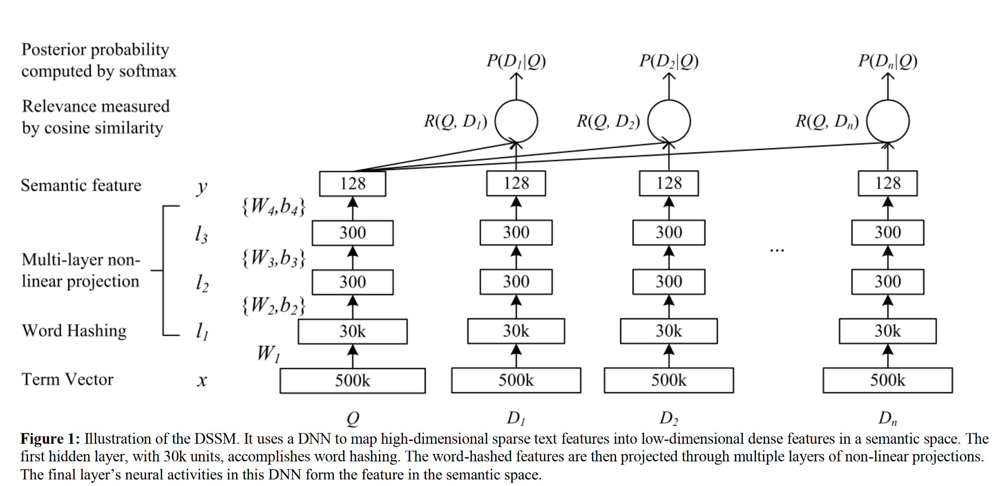

# 说明

这是一份关于推荐系统中DSSM模型的代码实现，本项目采用的是pytorch框架。

## DSSM介绍



算法思路：对于查询Q来说，通过DNN得到对应的语义特征，而对于所需要查询的$D_i$也通过另一个DNN来得到语义特征，此为双塔。最后通过相似函数（一般是内积或者其他函数）计算两边的相似度得到最后的预测概率结果，在本项目中，采用的是内积+sigmoid来得到相似结果。

# 简单使用

```python
python main.py
```

# 实验-召回

## 数据集

* ML-100k
* ML-1M

## 模型表现

| 数据集 | Recall@20 | NDCG@20 | Recall@50 | NDCG@50 |
| :-----: | :-------: | :-----: | :-------: | :-----: |
| ML-100k |  0.1304  | 0.0468 |  0.2860  | 0.0777 |
|  ML-1M  |  0.1551  | 0.0591 |  0.2874  | 0.0851 |

# TODO-List

* 使用多种数据集进行测试
* 增加记录模型训练过程，模型最优参数保存功能
* 使用argsparse，增加参数调节方式
